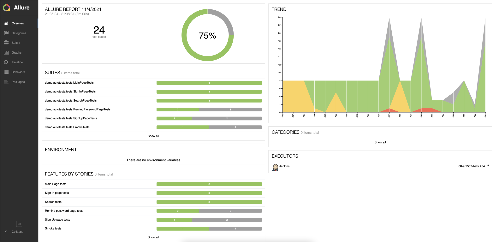

# Demo project with UI tests for Habr.com
<a target="_blank" href="https://habr.com/ru">Habr website</a>
###


# Technologies used:

| GitHub | IntelliJ IDEA | Java  | Junit5  |  Gradle | Selenide  | Selenoid  | Jenkins |Allure Report  | Telegram  |
|---|---|---|---|---|---|---|---|---|---|
|   |   |   |   |   |   |   |   | |   |

# Jenkins job

###


# Allure generates an informative report after each tests' run

###



###


# And Telegram bot sends notifications to whom it may concern with Allure report URL

###


# "Sign In" test video sample

#### Steps

1. Open main page
2. Click user profile icon
3. Click 'Sign In' button
4. Fill the form with email and password
5. Click 'Sign In' button
6. Verify sign in is successful

###


# Usage examples

### It needs to fill local.properties or pass values to run tests:

* browser (default chrome)
* browserVersion (default 91.0)
* browserSize (default 1920x1080)
* remoteDriverUrl (selenoid or grid url address). If empty, tests run locally
* videoStorage (url address where you should get video). Empty if remoteDriverUrl is empty

Run all tests:

```bash
./gradlew clean test
```

Run tests with properties:

```bash
./gradlew clean test -Dbrowser=chrome -DbrowserSize=1920x1080 -DremoteDriverUrl=https://%s:%s@selenoid.autotests.cloud/wd/hub/ -DvideoStorage=https://selenoid.autotests.cloud/video/ -Dthreads=4
```

Note: authorization required to run the command above. "%s:%s" should be replaced with login:password

Generate Allure report:

```bash
./gradlew allureServe
```
