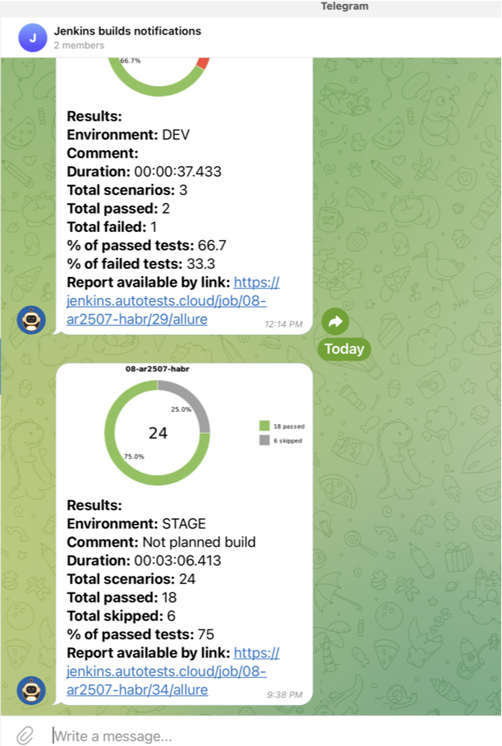

# Demo project with UI tests for Habr.com
<a target="_blank" href="https://habr.com/ru">Habr website</a>
###


# Technologies used:

| GitHub | IntelliJ IDEA | Java  | Junit5  |  Gradle | Selenide  | Selenoid  | Jenkins |Allure Report  |
|---|---|---|---|---|---|---|---|---|
|   |   |   |   |   |   |   |   |   |

# Jenkins job

<a target="_blank" href="https://jenkins.autotests.cloud/job/08-ar2507-habr/">Jenkins Habr UI Tests project</a>

###


# Allure generates an informative report after each tests' run

###


###


# And Telegram bot sends notifications to whom it may concern with Allure report URL

###



# "Sign In" test video sample

#### Steps

1. Open main page
2. Click user profile icon
3. Click 'Sign In' button
4. Fill the form with email and password
5. Click 'Sign In' button
6. Verify sign in is successful

###


# Usage examples

### It needs to fill remote.properties or pass values to run tests:

* browser (default chrome)
* browserVersion (default 91.0)
* browserSize (default 1920x1080)
* remoteDriverUrl (url address from selenoid or grid)
* videoStorage (url address where you should get video)
* threads (number of threads)

Run tests with filled remote.properties:

```bash
gradle clean test
```

Run tests with not filled remote.properties:

```bash
gradle clean -DremoteDriverUrl=https://%s:%s@selenoid.autotests.cloud/wd/hub/ -DvideoStorage=https://selenoid.autotests.cloud/video/ -Dthreads=1 test
```

Note: authorization required to run the command above. "%s:%s" should be replaced with login:password

Serve report:

```bash
gradle allureServe
```
