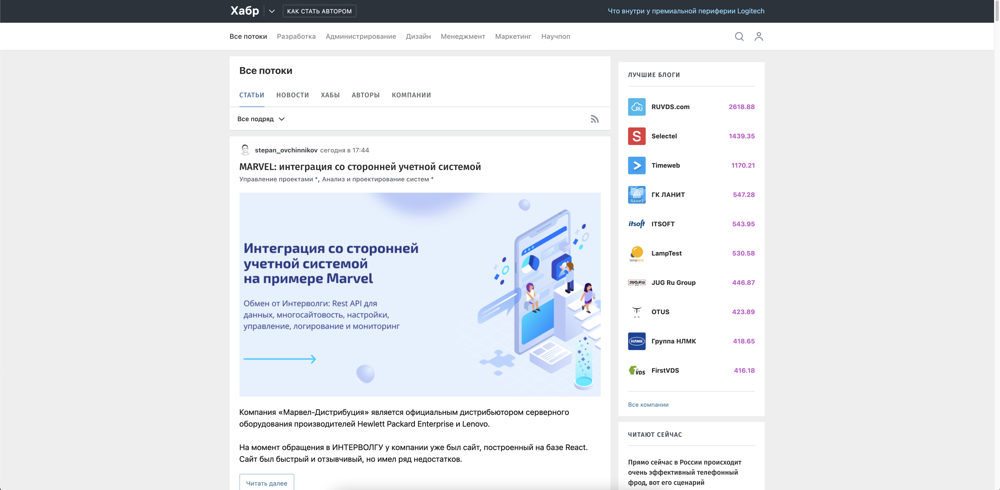

# Demo project with UI tests for Habr.com



# Technologies used:

| GitHub | IntelliJ IDEA | Java  | Junit5  |  Gradle | Selenide  | Selenoid  | Jenkins |Allure Report  |
|---|---|---|---|---|---|---|---|---|
|   |   |   |   |   |   |   |   |   |

# Jenkins job

<a target="_blank" href="https://jenkins.autotests.cloud/job/08-ar2507-habr/">Jenkins demo Habr UI Tests</a>


# Allure generates an informative report after each tests run


# USAGE examples

### For run remote tests need fill remote.properties or to pass value:

* browser (default chrome)
* browserVersion (default 89.0)
* browserSize (default 1920x1080)
* browserMobileView (mobile device name, for example iPhone X)
* remoteDriverUrl (url address from selenoid or grid)
* videoStorage (url address where you should get video)
* threads (number of threads)

Run tests with filled remote.properties:

```bash
gradle clean test
```

Run tests with not filled remote.properties:

```bash
gradle clean -DremoteDriverUrl=https://%s:%s@selenoid.autotests.cloud/wd/hub/ -DvideoStorage=https://selenoid.autotests.cloud/video/ -Dthreads=1 test
```

Serve report:

```bash
gradle allureServe
```
